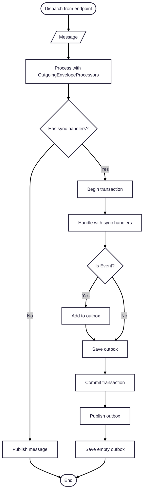
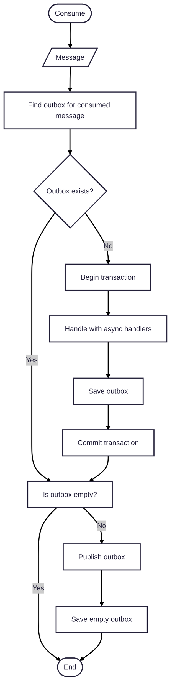

# Thesis MessageBus

[](https://packagist.org/packages/thesis/message-bus)
[](https://github.com/thesis-php/message-bus/releases)
[](https://codecov.io/gh/thesis-php/message-bus/tree/0.3.x)
[](https://dashboard.stryker-mutator.io/reports/github.com/thesis-php/message-bus/0.3.x)

## Installation

```shell
composer require thesis/message-bus
```

## Dispatch a message from endpoint

```php
$endpoint->dispatch(new Ping('Hi there!'));
```



## Consume message

```php
$endpoint->dispatch(new Ping('Hi there!'));
```


